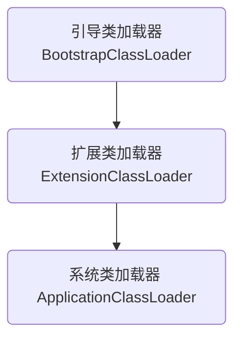

# 项目背景

支持多种数据源、多种版本的数据库元信息（表信息、字段信息等）同步功能。

为了加快同步效率，用到了线程池以此来加快同步效率。


## 面临的问题

因为有不同版本、不同数据库的驱动jar，因此不可能将所有的驱动jar都放在一起，因此使用了动态加载jar的方式来隔离不同的驱动jar。


# 初版设计

首先设计了所有数据源共同使用的接口，放在web模块，接口如下：

```java
public interface GetDBMetaDao {

    List<TableInfo> getAllTable(String tableSpace);

    List<FieldInfo> getAllColumn(String tableSpace, String tableName, String schameName);
}
```

然后在不同的数据源模块实现该接口，例如Hive 1.0模块、Hive2.0模块、Hbase1.4模块等，各个模块实现了接口后打成独立的Jar包，在需要的时候进行动态加载，动态加载代码如下：

```java
try {
    if (typeName.equals(DbType.HIVE_1.getType())) {
        jarFilePath = "file:" + dsPluginDirPath
            + File.separatorChar + "meta-hive1.jar";
        className = "com.huacloud.hds.meta.service.db.impl.GetHiveMetaDaoImpl";

    } else if (typeName.equals(DbType.HIVE_2.getType())) {
        jarFilePath = "file:" + dsPluginDirPath
            + File.separatorChar + "meta-hive2.jar";
        className = "com.huacloud.hds.meta.service.db.impl.GetHiveMetaDaoImpl";

    } else if (StringUtils.equalsIgnoreCase(DbType.HBASE.getType(), typeName)) {
        jarFilePath = "file:" + dsPluginDirPath
            + File.separatorChar + "meta-hbase.jar";
        className = "com.huacloud.hds.meta.service.db.impl.GetHbaseMetaDaoImpl";

    } else if (StringUtils.equalsIgnoreCase(DbType.HBASE_TBDS_513.getType(), typeName)) {
        jarFilePath = "file:" + dsPluginDirPath
            + File.separatorChar + "meta-hbase-tbds-513.jar";
        className = "com.huacloud.hds.meta.service.db.impl.GetHbaseTbds513MetaDaoImpl";

    } else if (StringUtils.equalsIgnoreCase(DbType.SOLR.getType(), typeName)) {
        jarFilePath = "file:" + dsPluginDirPath
            + File.separatorChar + "meta-solr.jar";
        className = "com.huacloud.hds.meta.service.db.impl.GetSolrMetaDaoImpl";

    } else if (StringUtils.equalsIgnoreCase(DbType.ES.getType(), typeName)) {
        jarFilePath = "file:" + dsPluginDirPath
            + File.separatorChar + "meta-es.jar";
        className = "com.huacloud.hds.meta.service.db.impl.GetElasticSearchMetaDaoImpl";

    } else if (StringUtils.equalsIgnoreCase(DbType.CLICKHOUSE.getType(), typeName)) {
        jarFilePath = "file:" + dsPluginDirPath + File.separatorChar + "meta-clickhouse.jar";
        className = "com.huacloud.hds.meta.service.db.impl.GetClickhouseMetaDaoImpl";
    } else {
        throw new BusinessException("不支持的类型：" + typeName);
    }

    URL url1 = new URL(jarFilePath);
    URLClassLoader myClassLoader1 = new URLClassLoader(
        new URL[]{url1},
        Thread.currentThread()
            .getContextClassLoader());
    Thread.currentThread().setContextClassLoader(myClassLoader1);
    Class<?> myClass1 = myClassLoader1.loadClass(className);
    Constructor<?> constructor = myClass1.getConstructor(DataSourceInfo.class);
    dbMetaDao = (GetDBMetaDao) constructor.newInstance(dataSource);
} catch (MalformedURLException
    | ClassNotFoundException
    | InstantiationException
    | IllegalAccessException
    | NoSuchMethodException
    | InvocationTargetException e) {
    throw new BusinessException("加载驱动包异常：" + jarFilePath, e);
}
```

代码解读：

1. 先根据数据源类型，获取jar包的路径和实现类的类名。
2. 使用URLClassLoader加载对应的jar包，然后实例化对应的类dbMetaDao。
3. 有了实例化的对象dbMetaDao，即可调取对应方法获取相应数据库的源信息。
4. 其中代码“Thread.currentThread().setContextClassLoader(myClassLoader1);”用于将初始化的类加载器设置为当前线程上下文类加载器，后面会具体介绍用途。
5. 这样就可以正常使用了，达到了我们预期的目的。


# 问题1：偶尔出现类依赖冲突的情况出现

在实际使用过程中，偶尔会出现不同数据源的驱动包出现类冲突的情况，深入研究后发现问题。


我们知道Spring的Controller层会出现线程复用的情况，然而我们一直在通过*`Thread.currentThread().setContextClassLoader(myClassLoader1);`*设置当前线程的上下文类加载器，这样如果发生了线程复用就会出现一个问题，例如如果请求Hive1、Hive2，HBase的请求都被一个线程复用的话，则类的加载器会出现如下继承关系：


如果一直重复的进行线程复用，那么类加载器的继承树会一直延伸下去，因为，为了解决这种问题，我们又想到了进行线程上下文类加载的切换。就是在每次使用前先把原有的上下文类加载器保存起来，然后使用完成之后恢复成原有的类加载器，代码如下：

```java
ClassLoader classLoader = Thread.currentThread().getContextClassLoader();
URLClassLoader myClassLoader1 = new URLClassLoader(
    new URL[]{url1},
    Thread.currentThread().getContextClassLoader());
Thread.currentThread().setContextClassLoader(myClassLoader1);
Class<?> myClass1 = myClassLoader1.loadClass(className);
Constructor<?> constructor = myClass1.getConstructor(DataSourceInfo.class);
dbMetaDao = (GetDBMetaDao) constructor.newInstance(dataSource);

// TODO:调用dbMetaDao接口方法获取需要的数据

// 恢复线程上下文类加载器
Thread.currentThread().setContextClassLoader(classLoader);
```

代码解读：

1. 先保存当前的线程上下文类加载器。
2. 再设置当前线程的上下文类加载为驱动包的类加载器。
3. 再实例化GetDBMetaDao接口进行数据库访问。
4. 数据库访问完成之后，恢复原有的线程上下文类加载器。


# 问题2：为什么要使用线程的上下文类加载器？

谈到这个问题，我们需要先了解一般的普通类加载器和线程上下文类加载器的区别了。

普通类加载器遵循双亲委派的模式进行加载，这里就不细说这个模式，大家可以自行百度，这方面的文章还是比较多的。但是普通类加载器有一个最大的问题，就是无法用父类加载器加载子类，例如我们熟悉的Java SPI （Service Provider Interface）服务提供接口，因为这个接口是Bootstrap加载器加载的，而具体的实现类是由AppClassLoader加载的。



## 例1：源码分析

当我们实现好了SPI接口后，可以通过如下代码进行获取：

```java
ServiceLoader<HelloService> loaders = ServiceLoader.load(HelloService.class);
for (HelloService helloService : loaders) {
    helloService.hello();
}
```

大家发现没有，并没有new出任何实现类，既然直接获取到接口实现。这说明具体实现类是通过ServiceLoader内部进行加载出来的，但是我们知道ServiceLoader是通过引导类加载器来加载的，而HelloService的实现类是通过系统类加载器来加载的，为什么引导类可以加载到HelloService的实现类呢？这就需要用到线程上下文类加载器了。我们看看ServiceLoader.load方法的源码：

```
public static <S> ServiceLoader<S> load(Class<S> service) {
	ClassLoader cl = Thread.currentThread().getContextClassLoader();
	return ServiceLoader.load(service, cl);
}
```

从里面就可以看到，在加载具体的实现类时，是通过线程的上下文类加载器（Thread.currentThread().getContextClassLoader()）来加载的，这样就避免了引导类加载器无法加载由系统类加载器加载的类，从而解决了我们刚才讨论的问题。


## 例2：代码分析

1、用IDEA新开发一个项目，只需要一个代码文件：

```java
package com.pxd;

import java.lang.reflect.Method;

public class ClassLoaderDemo {

    /**
     * 通过本地类加载器执行指定类的方法
     *
     * @param className
     * @param methodName
     * @throws Exception
     */
    public static void callClassLoader(String className, String methodName) throws Exception {
        ClassLoader classLoader = ClassLoaderDemo.class.getClassLoader();
        System.out.println("classLoader:" + classLoader);
        Class<?> aClass = classLoader.loadClass(className);
        Method method = aClass.getMethod(methodName);
        method.invoke(aClass.newInstance());

    }

    /**
     * 通过线程上下文类加载器执行指定类的方法
     *
     * @param className
     * @param methodName
     * @throws Exception
     */
    public static void callThreadClassLoader(String className, String methodName) throws Exception {
        ClassLoader classLoader = Thread.currentThread().getContextClassLoader();
        System.out.println("classLoader:" + classLoader);
        Class<?> aClass = classLoader.loadClass(className);
        Method method = aClass.getMethod(methodName);
        method.invoke(aClass.newInstance());
    }

}
```

只含有2个方法，一个用本地类加载器进行加载执行；另一个用线程上下文类加载器进行加载执行。

将该项目打成classdemo.jar放入JAVA_HOME\jre\lib\ext\目录下，放在这个目录的作用是让扩展类加载器加载这个jar包，而不是系统类加载器。

2、再新建一个项目，编写2个类，代码如下：

```java
package com.example.demo;

public class Hello {

    public static void say() {
        System.out.println("Hello world!");
    }

}
```


```java
package com.example.demo;

import com.pxd.ClassLoaderDemo;
import org.junit.Test;

public class Demo {
    
    @Test
    public void testLocalClassLoader() throws Exception {
        ClassLoaderDemo.callClassLoader(
            "com.example.demo.Hello",
            "say");
    }

    @Test
    public void testThreadClassLoader() throws Exception {
        ClassLoaderDemo.callThreadClassLoader(
            "com.example.demo.Hello",
            "say");
    }

}
```


3、分别运行Demo类的2个单元测试方法

就会发现第一个运行出现异常：

classLoader:sun.misc.Launcher$ExtClassLoader@4769b07b
Exception in thread "main" java.lang.ClassNotFoundException: com.example.demo.Hello
	at java.net.URLClassLoader.findClass(URLClassLoader.java:382)
	at java.lang.ClassLoader.loadClass(ClassLoader.java:418)
	at java.lang.ClassLoader.loadClass(ClassLoader.java:351)
	at com.pxd.ClassLoaderDemo.callClassLoader(ClassLoaderDemo.java:17)
	at com.example.demo.Demo.main(Demo.java:8)

第二个可以正常运行。


代码解释：

1、ClassLoaderDemo类是由扩展类加载器加载；

2、Hello类和Demo类是由系统类加载器加载；

3、扩展类加载器是系统类加载器的父加载器；

4、运行失败的单元测试，说明父加载器不能加载子加载器的类；

5、如果想让父加载器加载子加载器的类，必须使用线程上线文类加载器；


## 回到问题本身

回到项目问题本身，为什么我们最开始的项目需要使用线程上下文类加载器呢？

其实，一般的驱动，例如：MySQL驱动、Oracle驱动等普通关系型数据库的驱动，不会涉及到需要加载子类加载器的类。但是有些分布式数据库则会用到线程上下文类加载器加载类，例如Hbase，我们来看看Hbase API的源码：

在hadoop-common-2.7.2.jar中，org.apache.hadoop.conf.Configuration类的属性private ClassLoader classLoader，大概在668行左右：

```java
private ClassLoader classLoader;
{
  classLoader = Thread.currentThread().getContextClassLoader();
  if (classLoader == null) {
    classLoader = Configuration.class.getClassLoader();
  }
}
```

可以明显的看出，配置文件中的类加载是通过线程上下文类加载器来进行加载的。因此，我们在调用GetDBMetaDao的方法时，一定要修改线程上下文类加载器，否则会出现找不到类的异常：

`java.lang.ClassNotFoundException: Class org.apache.hadoop.net.StandardSocketFactory not found`

至此，我们先解释了普通加载器和线程上下文类加载器的区别，然后用源码和代码实例的方式讲解了区别，并在实际项目中也解释了为什么需要设置线程上线文类加载器。


# 问题3： GetDBMetaDao接口的方法调用的地方过多怎么办？

（未完，把项目中的这个问题处理完后再来把文章补充完整）


# 问题4：在多线程环境下如何处理线程上下文类加载器？

（未完，把项目中的这个问题处理完后再来把文章补充完整）


